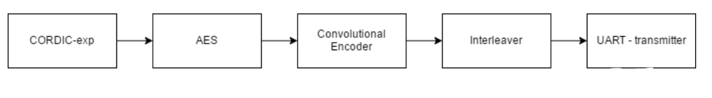
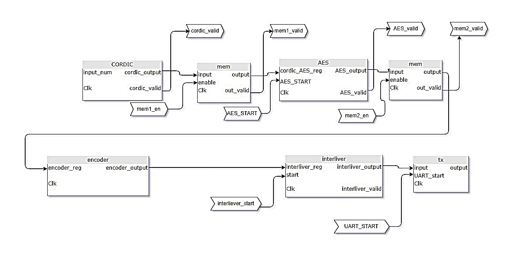

# Reliable transmitter in HDL

**Course project of [ASIC/FPGA design course](http://ee.sharif.edu/~asic/) (Spring 2017)**

This repository contains an implementation of a reliable transmitter. The transmitter includes several modules for modulation, encryption, encoding, and interleaving of data bits. An overview of modules is shown below.

  

## Modules
### Modulation
To implement modulation module we need to calculate exponential functions. we will use CORDIC, which is a simple algorithm for calculating hyperbolic and trigonometric functions without using multipliers. This algorithm is very efficient for hardware implementation.

### Encryption
AES will be used for encryption.

### Encoder
In transmitter, encrypted data should be encoded and prepared to be transmitted. For that, convolutional encoder is used. This operation has an effect on the length of the data and it helps to detect and correct random errors which happened in channel.

### Data Interleaver
We will use a simple reordering of data bytes to reduce the effect of burst errors.

### UART transmitter
A simple UART transmitter is implemented to send data bytes ob a physical medium.

## Code structure
Transmitter.v includes the top module for project. Wiring between different modules in shown in figure below:

  

